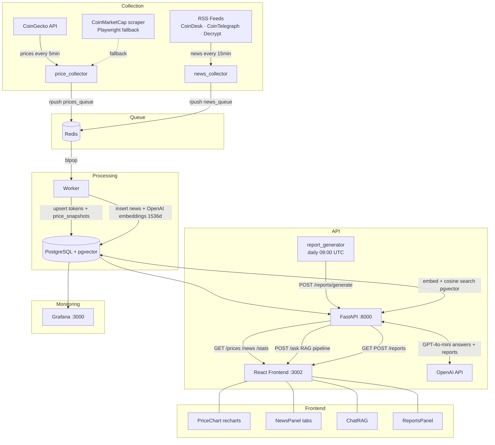

# Crypto RAG Intelligence Platform

> Real-time AI-powered cryptocurrency market analysis using
> Retrieval-Augmented Generation (RAG) over live market data.


## Overview

This platform collects real-time cryptocurrency prices and news, generates semantic vector embeddings, and answers natural language questions about the crypto market using a RAG pipeline.

**Example:**

Question : "What is happening with Bitcoin this week?"

Answer   : "Bitcoin is rebounding this week, holding above $74,000 after breaking the $73,000 resistance. The move is driven by strong ETF inflows and improving risk sentiment..."
Sources  : CoinDesk (Apr 15), CoinTelegraph (Apr 14)

## Architecture



## Tech Stack

| Layer | Technology |
|---|---|
| Price data | CoinGecko API |
| News data | RSS feeds (CoinDesk, CoinTelegraph, Decrypt) |
| Fallback scraper | Playwright + BeautifulSoup |
| Message queue | Redis |
| Database | PostgreSQL + pgvector |
| Embeddings | OpenAI text-embedding-3-small (1536 dims) |
| Vector index | pgvector HNSW (cosine similarity) |
| LLM | OpenAI GPT-5.4-mini |
| API | FastAPI |
| Monitoring | Grafana |
| Infrastructure | Docker Compose — 8 services |

## Project Structure

crypto-rag-project/
├── api/
│   ├── main.py             # FastAPI endpoints (/ask, /health)
│   ├── rag.py              # RAG pipeline (embed, search, generate)
│   └── Dockerfile
├── collectors/
│   ├── price_collector.py  # CoinGecko API — every 5 minutes
│   ├── news_collector.py   # RSS feeds — every 15 minutes
│   ├── Dockerfile
│   └── scrapers/
│       ├── app.py          # Fallback scraper microservice
│       ├── coinmarketcap.py
│       └── Dockerfile
├── worker/
│   ├── worker.py           # Redis queue processor
│   ├── embedding.py        # OpenAI embedding generation
│   └── Dockerfile
├── bdd/
│   └── schema.sql          # PostgreSQL + pgvector schema
├── grafana/                # Dashboard configuration
├── docker-compose.yml      # 8 services orchestration
└── .env.exemple            # Environment variables template

## Services

| Service | Role | Port |
|---|---|---|
| postgres | PostgreSQL + pgvector | 5432 |
| redis | Message queue | 6379 |
| worker | Queue processor + embeddings | — |
| price_collector | CoinGecko price fetcher | — |
| news_collector | RSS news fetcher | — |
| scraper | CoinMarketCap fallback | 8001 |
| api | FastAPI RAG endpoint | 8000 |
| grafana | Monitoring dashboard | 3000 |

## Quick Start

### Prerequisites

- Docker Desktop
- OpenAI API key — [platform.openai.com](https://platform.openai.com)
- CoinGecko API key — [coingecko.com/developers](https://www.coingecko.com/en/developers/dashboard)

### Installation

```bash
git clone https://github.com/DavRengifo/crypto-rag-project.git
cd crypto-rag-project

# Configure environment variables
cp .env.exemple .env
# Edit .env with your API keys

# Build and start all services
docker compose up --build -d

# Check all services are running
docker ps
```

### Verify the data pipeline

```bash
docker exec -it postgres_container psql -U your_user -d crypto_rag \
  -c "SELECT COUNT(*) FROM tokens;
      SELECT COUNT(*) FROM price_snapshots;
      SELECT COUNT(*) FROM news;
      SELECT COUNT(*) FROM embeddings_news;"
```

## API Reference

### `POST /ask`

Ask a natural language question about the crypto market.

**Request**
```json
{
  "question": "Why is Ethereum dropping today?"
}
```

**Response**
```json
{
  "answer": "Ethereum is down today due to...",
  "sources": [
    {
      "title": "ETH drops amid market uncertainty",
      "source": "CoinDesk",
      "published_at": "2026-04-15T10:00:00Z",
      "distance": 0.4415
    }
  ]
}
```

### `GET /health`

```json
{"status": "ok"}
```

### Interactive API docs

http://localhost:8000/docs


## Database Schema

```sql
tokens          -- tracked cryptocurrencies (BTC, ETH, SOL...)
price_snapshots -- price history with market_cap, volume, change_24h
news            -- collected articles with source and published_at
embeddings_news -- vector embeddings (1536 dims, HNSW cosine index)
```
## Roadmap

- [x] Real-time price collection (CoinGecko API)
- [x] News collection (RSS feeds)
- [x] Vector embeddings (OpenAI text-embedding-3-small)
- [x] RAG pipeline (pgvector HNSW + GPT-5.4-mini)
- [x] REST API (FastAPI)
- [ ] React frontend with chat interface
- [ ] Sentiment analysis
- [ ] CI/CD (GitHub Actions)
- [ ] Cloud deployment
- [ ] User authentication + subscriptions (V2)
- [ ] Price trend predictions (V3)

## License

MIT